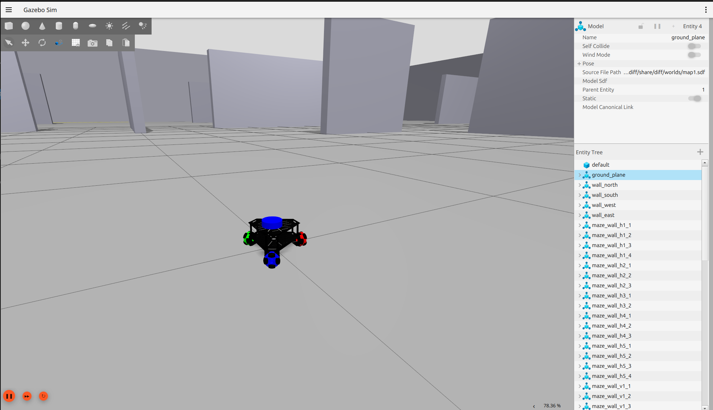
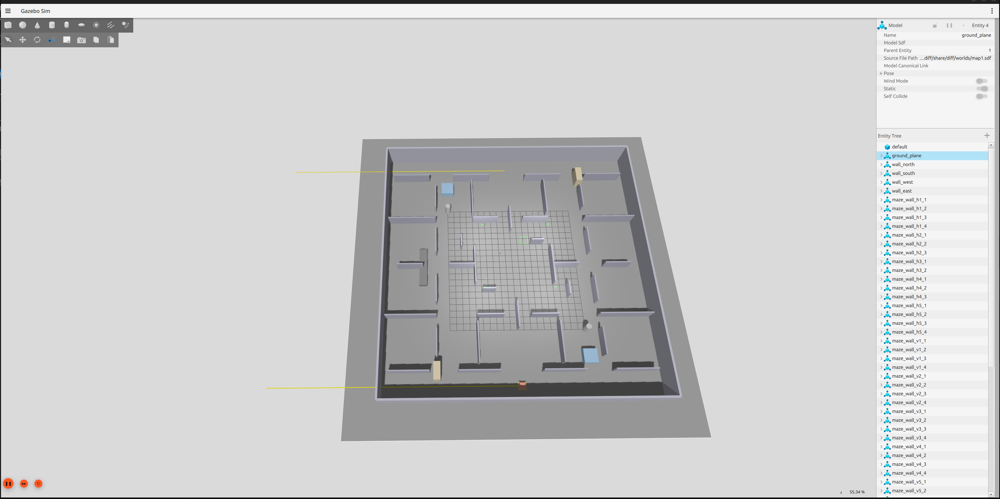

# 3WD_OMNI_ROBOT

Original: https://github.com/Seda-cpu/3WD_OMNI_ROBOT



## Thư mục project 
```
cd ~/3WD_OMNI_ROBOT/diff/
```

## Build Package
```
colcon build --packages-select diff --symlink-install
```

## Về Project 

### khởi động Gazebo & Rviz:
```
source install/setup.bash
ros2 launch diff sim.launch.py
```

### Điều khiển với phím bấm
#### Chạy bộ chuyển đổi topic của controller sang topic của Robot:
```
source install/setup.bash
ros2 run diff converter.py
```
#### Chạy bảng điều khiển phím bấm:
```
ros2 run teleop_twist_keyboard teleop_twist_keyboard
```

### Chạy tự động

#### khởi chạy file `otonom1.py` để robot tự di chuyển: 
```
source install/setup.bash
ros2 run diff otonom1.py --ros-args -p use_sim_time:=true
```

#### Bridge cho 3 cảm biến siêu âm:
```
ros2 run ros_gz_bridge parameter_bridge /sonar/front@sensor_msgs/msg/LaserScan[gz.msgs.LaserScan /sonar/left@sensor_msgs/msg/LaserScan[gz.msgs.LaserScan /sonar/right@sensor_msgs/msg/LaserScan[gz.msgs.LaserScan
```